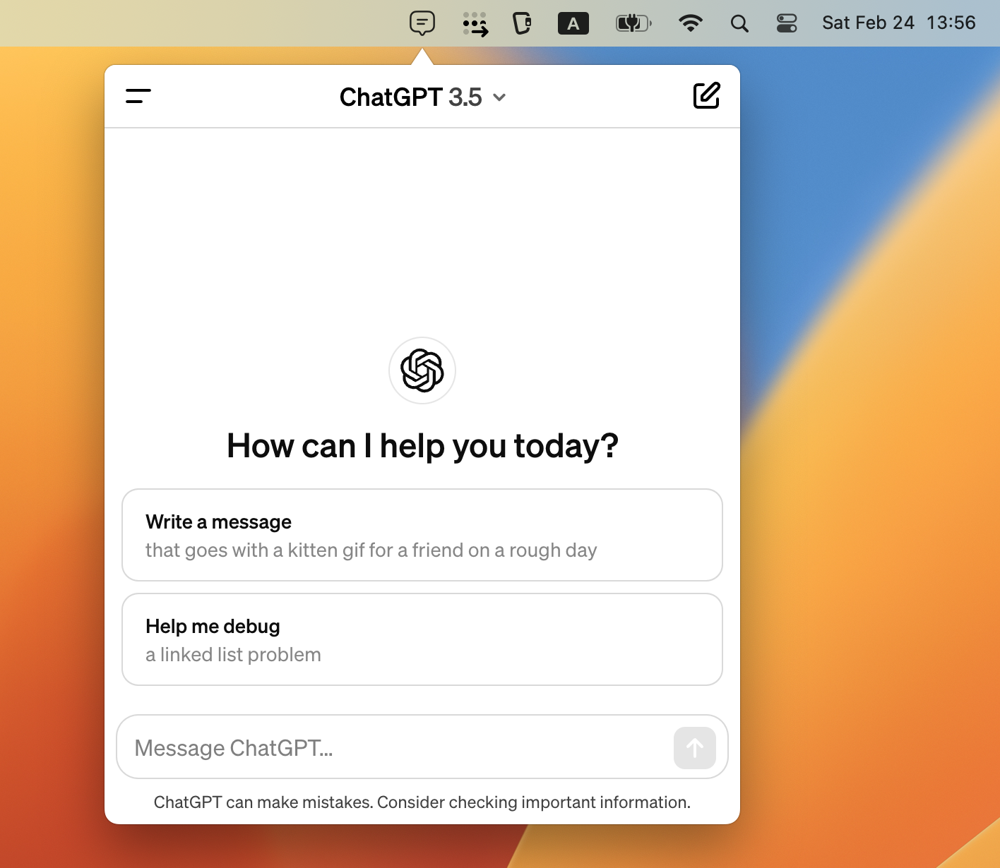

  
  <h1>Chat Bar</h1>
  <h3>ChatGPT in the menu Bar</h3>
  

**Chat Bar is a cross-platform desktop application that provides quick access to ChatGPT from the tray (menu bar).**

## Downloads

The application supports the following operating systems. Visit the [release page](https://github.com/rabrain/chat-bar-docs/releases) to download the app.

- Windows
- Mac OS X
- Linux

## Contact Us

For any questions or feedback, please reach out to us on the [discussion forum](https://github.com/rabrain/chat-bar-docs/discussions).