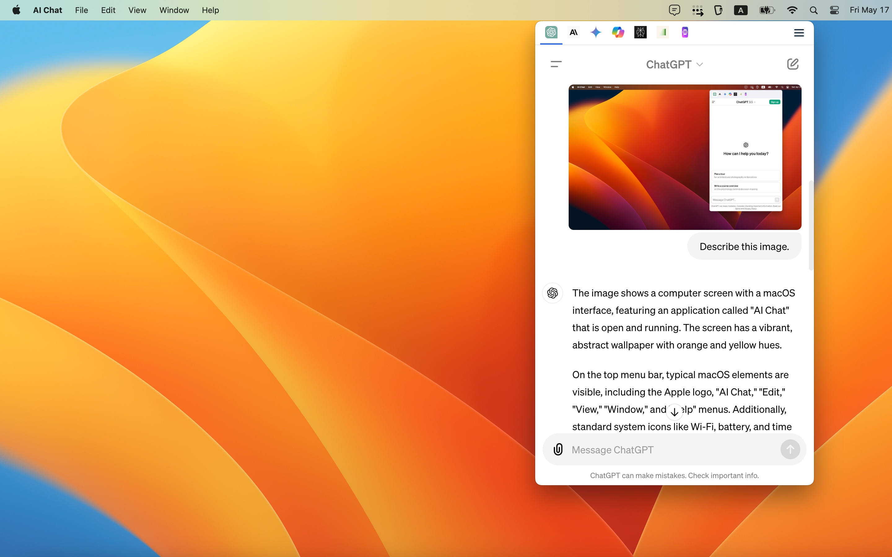

  
  <h1>AI Chat</h1>
  <h3>Open AI Chat Bot in the Menu Bar</h3>

  
  
  
  

  

 

**AI Chat is a cross-platform desktop application that provides quick access to chatbots like OpenAI ChatGPT from the menu bar (tray).**

By having it reside on the menu bar, we eliminate the need to switch between windows when using ChatGPT as our daily assistant. It also enables us to have a streamlined workflow, as we can easily multitask and communicate with the AI without interrupting our current tasks.

https://github.com/rabrain/ai-chat/assets/705652/16fae1a2-ba22-44e0-a2cc-d5beb88290bf

## Open AI Chat Bot in One Place
Quick access to AI chatbot of your choice, including
- [OpenAI ChatGPT](https://chat.openai.com)
- [Claude](https://claude.ai)  
- [Google Gemini](https://gemini.google.com)
- [Microsoft Copilot](https://copilot.microsoft.com/)
- [Perplexity](https://www.perplexity.ai/)
- [Pi](https://pi.ai)
- [Poe](https://poe.com)

## Downloads

The application supports the following operating systems. Visit the [release page](https://github.com/rabrain/ai-chat/releases/latest) to download the app.

- Windows
- Mac OS X
- Linux

## Contact Us

For any questions or feedback, please reach out to us on the [discussion forum](https://github.com/rabrain/ai-chat/discussions).
